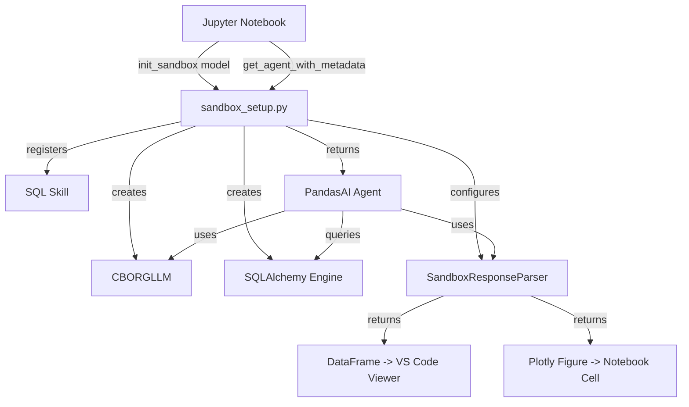

# Plan: AI Sandbox Refactoring and Hardening

This plan outlines the steps to improve the `ai_exploration` sandbox, addressing
rendering issues, model selection, and code quality.

## Objectives

1.  **Harden `sandbox_setup.py`**: Remove brittle monkey-patches and improve
    error handling.
2.  **Model Configuration**: Provide a clear mechanism for selecting LLM models.
3.  **Improved Rendering**: Fix Plotly duplication and ensure DataFrames trigger
    the VS Code Data Viewer.
4.  **API Alignment**: Ensure full compatibility with PandasAI 3.0 patterns.

## Proposed Changes

### 1. `analysis/ai_exploration/sandbox_setup.py`

- **Refactor `CBORGLLM`**:
  - Use `requests.Session` for connection pooling.
  - Add timeout handling.
  - Improve error reporting when the API returns non-JSON responses.
- **Custom `ResponseParser`**:
  - Implement a `SandboxResponseParser` class inheriting from
    `pandasai.responses.response_parser.ResponseParser`.
  - Override `parse` to return raw objects (DataFrames, Plotly Figures) instead
    of file paths where possible.
  - Remove the global monkey-patching of `BaseResponse._repr_html_`.
- **Model Selection**:
  - Update `init_sandbox(model_name: str = None)` to allow override.
  - Define a constant `AVAILABLE_MODELS` for easier discovery.
- **SQL Skill Hardening**:
  - Improve the `execute_sql_query` skill to better handle schema-qualified
    names.
  - Add a check to prevent non-SELECT queries (basic safety).

### 2. Rendering Fixes

- **Plotly**:
  - Configure `pio.renderers.default = 'notebook'` or `vscode`.
  - Ensure the `ResponseParser` returns the Plotly `Figure` object directly.
- **DataFrames**:
  - Ensure that when the agent returns a table, it is returned as a
    `pd.DataFrame` so VS Code's interactive data viewer is triggered.

### 3. Notebook Updates (`sandbox_exploration.ipynb`)

- Update initialization cell to use the new model selection parameter.
- Simplify the setup code by moving more logic into `sandbox_setup.py`.

## Mermaid Diagram of New Architecture

## TODO List

- [ ] Review `CBORGLLM` and implement `requests.Session` + timeouts.
- [ ] Create `SandboxResponseParser` to handle Plotly and DataFrames without
      monkey-patching.
- [ ] Update `init_sandbox` with `model_name` parameter and `AVAILABLE_MODELS`
      list.
- [ ] Refactor `get_agent_with_metadata` to use the new `ResponseParser`.
- [ ] Test Plotly rendering in VS Code to ensure single, interactive outputs.
- [ ] Verify DataFrame outputs trigger the VS Code Data Viewer.
- [ ] Update `sandbox_exploration.ipynb` and `ai_analysis.ipynb` setup cells.
