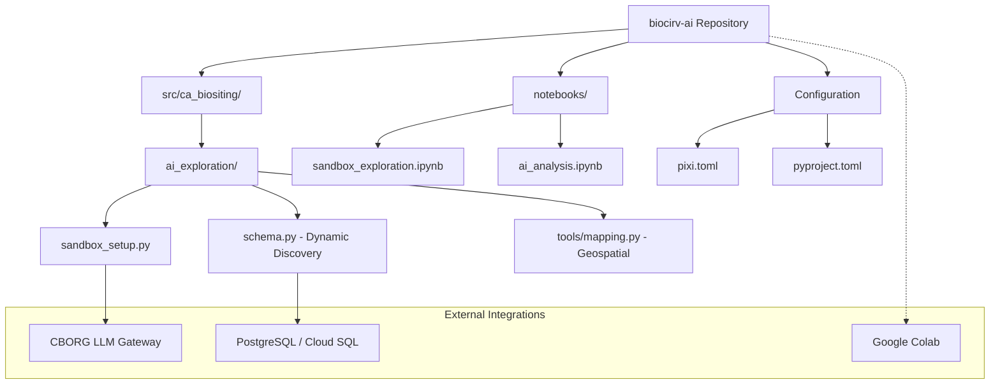

# Plan: biocirv-ai Standalone Migration

## Objective
Migrate the `analysis/ai_exploration` sandbox from the `ca-biositing` monorepo into a standalone repository named `biocirv-ai` within the `sustainability-software-lab` organization. The new repository will be structured as a PEP 420 namespace package (`ca_biositing.ai_exploration`) and linked back to the main project as a git submodule.

## 🏗️ Repository Structure (Standalone biocirv-ai)
The desired final state of the `biocirv-ai` repository:

```text
biocirv-ai/
├── src/
│   └── ca_biositing/              # No __init__.py (Namespace)
│       └── ai_exploration/        # Package implementation
│           ├── __init__.py        # Package initialization
│           ├── sandbox_setup.py   # Core logic (hardened LLM & Parser)
│           ├── schema.py          # NEW: Automatic schema discovery
│           └── tools/             # NEW: Geospatial & custom tools
│               ├── __init__.py
│               └── mapping.py     # Folium/Geopandas integration
├── notebooks/                     # Analysis playground
│   ├── ai_analysis.ipynb
│   └── sandbox_exploration.ipynb
├── tests/                         # Pytest suite
│   ├── __init__.py
│   └── test_parser.py
├── .env.example                   # Template for credentials
├── .gitignore                     # Standard Python/Pixi gitignore
├── LICENSE                        # Project license
├── pixi.toml                      # Pixi environment & task management
├── pyproject.toml                 # Package metadata (Hatch-based)
└── README.md                      # Setup & usage instructions
```

## 🛠️ Required Steps

### 1. Repository Initialization (Standalone)
- Create the `biocirv-ai` directory structure.
- Initialize `pyproject.toml` with `hatchling` build backend (Organization: `sustainability-software-lab`).
- Initialize `pixi.toml` with the following environments:
  - `default`: Core analysis tools.
  - `gis`: `geopandas`, `folium`, `shapely`.
  - `dev`: `pytest`, `pre-commit`.

### 2. Core Logic Refactoring
- Move `sandbox_setup.py` to `src/ca_biositing/ai_exploration/`.
- Refactor imports to use the new namespace structure.
- Update `SandboxResponseParser` to be more modular.

### 3. Dynamic Schema Discovery
- Create `schema.py`.
- Implement `discover_views(engine, schema_names)` to query `information_schema.views`.
- Integrate discovery into the `Agent` initialization flow.

### 4. Geospatial Integration
- Implement Folium/Geopandas detection in `SandboxResponseParser`.
- Add mapping utilities to `tools/mapping.py`.

### 5. Notebook Migration
- Update `ai_analysis.ipynb` and `sandbox_exploration.ipynb`.
- Change setup logic to import from `ca_biositing.ai_exploration`.

### 6. Main Repository Integration
- Add `biocirv-ai` as a git submodule at `analysis/biocirv-ai`.
- Remove the legacy `analysis/ai_exploration` directory.
- Update the main `ca-biositing/pixi.toml` to install the new package in editable mode from the submodule path.

### 7. Documentation & Verification
- Create a comprehensive `README.md` covering local setup, submodule management, and Google Colab usage.
- Verify `pixi install` and kernel registration works as expected in both the standalone and main repo contexts.

## 🔗 Final State Architecture


